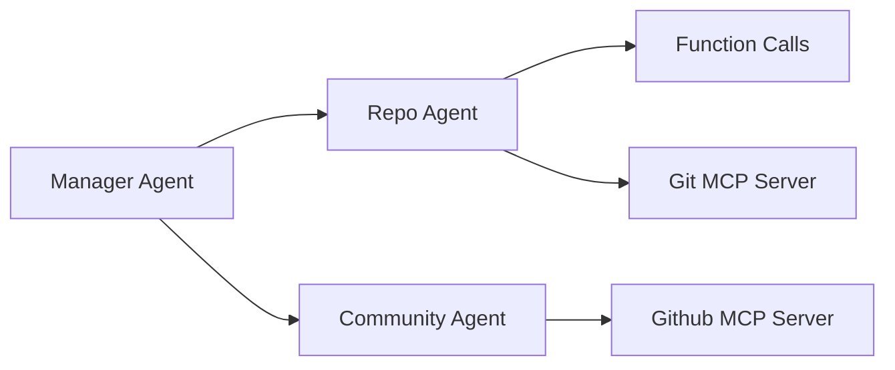

<div align="center">
  <h1>RepoCompass</h1>
</div>

**RepoCompass** is an LLM-based GitHub repository evaluation assistant that assesses both technical standards compliance and community activity metrics for open-source projects.

## ✨ Features

- **Automated Repository Standards Assessment**
  - Checks for essential documentation (README, CONTRIBUTING, ROADMAP etc.)
  - Verifies license presence
  - Provides actionable improvement suggestions

- **Community Activity Analysis**
  - Measures issue response time and resolution rate
  - Analyzes commit frequency and contributor activity

- **AI-Powered Insights**
  - Natural language evaluation reports
  - Actionable recommendations for improvement
  - Comparative scoring against industry standards

## 🧠 Architecture Overview

RepoCompass uses a multi-agent system powered by OpenAI's Agent SDK:



### Core Agents

1. **Manager Agent**  
   - Routes requests to appropriate evaluation agents
   - Consolidates results into final report
   - Handles user communication

2. **Repo Agent**  
   - Performs local repository analysis
   - Uses function calling for file system operations
   - Interfaces with Git API via MCP server
   - Evaluates documentation quality and project structure

3. **Community Agent**  
   - Interfaces with GitHub API via MCP server
   - Analyzes community engagement metrics
   - Assesses project activity and maintenance patterns

## ⚙️ Installation

Download github-mcp-server from [here](https://github.com/github/github-mcp-server/releases)

```bash
# Clone the repository
git clone https://github.com/zhenjunMa/RepoCompass.git
cd RepoCompass

# Install playwright if needed
uv run playwright install 

# Set up environment variables
cp config/config.example.toml config/config.toml

# Install dependencies
uv venv .venv --python=3.12
source .venv/bin/activate
uv sync

uv run main.py

# please input your github repo url: ${github repo url}
```

## 🚀 Usage

### Sample Output

```
### 📊 **Repository Analysis: AAA/bbb**

Here’s a detailed breakdown of the repository's standardization and community activity:

---

#### 📂 **Repository Standardization**
✅ **README**: Present  
✅ **Quickstart Guide**: Available  
✅ **Contributors Guide**: Included  
⚠️ **Roadmap**: Missing  
✅ **Official Website**: Linked  
📜 **License**: MIT  
🔄 **Update Frequency**: Every ~2.3 days (last updated 20 days ago)  

**Insight**: The repository is well-documented with essential guides and an MIT license, but a roadmap could improve project transparency.

---

#### 🚀 **Community Activity Score**
🔢 **Final Score**: 49/100  

**Breakdown**:  
- **Issue Responsiveness**: 49/50 (average response time: ~18 hours)  
- **Growth Metrics**: 0/50 (stars and contributors data unavailable)  

**Key Findings**:  
⚠️ **Issue Management**: Recent issues are addressed promptly, but some older issues (e.g., #720) have been inactive for months.  
⚠️ **Growth Data**: Lack of recent stars and contributors data impacts the score.  

---

#### 🎯 **Recommendations**
1. **Add a Roadmap**: Enhance project direction clarity.  
2. **Monitor Older Issues**: Address or close inactive issues to maintain engagement.  
3. **Encourage Contributions**: Promote the repository to attract more stars and contributors.  
```

## 🌐 Roadmap

- [x] Auto download repo from Github
- [x] Crawler for more data
- [ ] Historical trend analysis
- [ ] Custom evaluation rule sets

## 🤝 Contributing

We welcome contributions! Please see our [CONTRIBUTING.md](CONTRIBUTING.md) for guidelines.

## 📜 License

This project is licensed under the MIT License - see the [LICENSE](LICENSE) file for details.
