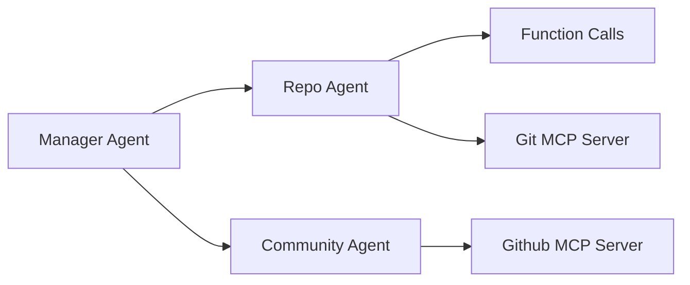

<div align="center">
  <h1>RepoCompass</h1>
</div>

**RepoCompass** is an AI-powered GitHub repository evaluation assistant that assesses both technical standards compliance and community activity metrics for open-source projects.

## ✨ Features

- **Automated Repository Standards Assessment**
  - Checks for essential documentation (README, CONTRIBUTING, ROADMAP etc.)
  - Verifies license presence
  - Provides actionable improvement suggestions

- **Community Activity Analysis**
  - Measures issue response time and resolution rate
  - Analyzes commit frequency and contributor activity

- **AI-Powered Insights**
  - Natural language evaluation reports
  - Actionable recommendations for improvement
  - Comparative scoring against industry standards

## 🧠 Architecture Overview

RepoCompass uses a multi-agent system powered by OpenAI's Agent SDK:



### Core Agents

1. **Manager Agent**  
   - Routes requests to appropriate evaluation agents
   - Consolidates results into final report
   - Handles user communication

2. **Repo Agent**  
   - Performs local repository analysis
   - Uses function calling for file system operations
   - Evaluates documentation quality and project structure

3. **Community Agent**  
   - Interfaces with GitHub API via MCP server
   - Analyzes community engagement metrics
   - Assesses project activity and maintenance patterns

## ⚙️ Installation

Download github-mcp-server from [here](https://github.com/github/github-mcp-server/releases)

```bash
# Clone the repository
git clone https://github.com/zhenjunMa/RepoCompass.git
cd RepoCompass

# Set up environment variables
cp config/config.example.toml config/config.toml

# Install dependencies
uv venv .venv --python=3.12
source .venv/bin/activate
uv sync

uv run main.py

# please input your github repo url: ${github repo url}
```

## 🚀 Usage

### Sample Output

```
Here's the evaluation summary for the XXX repository:

### Standardization Evaluation
1. **Documentation**:
   - ✅ **README**: Comprehensive and includes a quickstart guide.
   - ❌ **CONTRIBUTING Guidelines**: Missing.
   - ❌ **ROADMAP**: Missing.
   - ✅ **Official Website Link**: Included (Hugging Face Demo).

2. **Licensing**:
   - ✅ **MIT License**: Clearly stated in the `LICENSE` file.

3. **Code Activity**:
   - **Average Update Interval**: ~7.5 days (last 10 commits).
   - **Last Change**: 19 days ago.

**Recommendations**:
- Add a `CONTRIBUTING.md` file to guide contributors.
- Include a `ROADMAP.md` to outline future plans.
- Maintain more frequent updates for better engagement.

---

### Community Activity Score
**Final Score**: **65/100**  
**Breakdown**:
1. **Issue Responsiveness**: 48/50 (average response time of ~48 hours).
2. **Growth Analysis**: 17/50 (penalized due to missing data on stars and contributors).

**Note**: The score could improve with available growth metrics (stars, contributors).
```

## 🌐 Roadmap

- [x] Auto download repo from Github
- [ ] Crawler for more data
- [ ] Historical trend analysis
- [ ] Custom evaluation rule sets

## 🤝 Contributing

We welcome contributions! Please see our [CONTRIBUTING.md](CONTRIBUTING.md) for guidelines.

## 📜 License

This project is licensed under the MIT License - see the [LICENSE](LICENSE) file for details.
